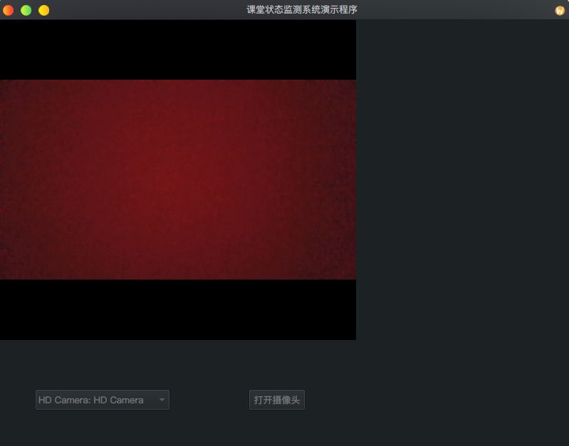

# Student Status Identification
> 线上课堂状态监测系统

## 编译说明
1. 根据不同平台不同，这里具体说明环境搭建；
2. 环境：c++、qt、opencv、dlib、make以及cmake；
3. 编译：

    1. `git clone https://github.com/sunowsir/Student_Status_Identification.git`
    2. `cd Student_Status_Identification`
    3. `mkdir build`
    4. `cd build`
    5. `cmake -DCMAKE_EXPORT_COMPILE_COMMANDS=1 ../`
    6. `make`
    7. 编译完成后会在`../bin`下生成可执行文件`SSI`

## 技术说明
1. 语言：`c++`；
2. 开发框架：`qt`；
3. 图像处理库：`opencv`、`dlib`；

## 设计说明
> 如下以图像处理为主，其他部分例如UI部分则简略介绍；

### UI

该程序使用qt来绘制UI，其中包括摄像头预览界面以及各种button等；


### 人脸识别器

1. 类声明如下：

人脸识别器用于初步处理图像，并获取到人脸特征点，该类是表情识别的最基础的必须的类
```c++
/* 人脸识别器 */
class SSI_Face_Recognition {
private: 
    /* 人脸形状探测器 */
    dlib::shape_predictor sp;

    /* 一系列人脸所在区域 */
    std::vector<dlib::rectangle> faces;

    /* 人脸特征点分布 */
    std::vector<dlib::full_object_detection> shapes;

    /* 加载dlib的人脸识别器 */
    dlib::frontal_face_detector detector;

public: 
    SSI_Face_Recognition(const QString&);
    ~SSI_Face_Recognition();

    bool recognize(cv::Mat&);
    std::vector<dlib::rectangle>& faces_get();
    std::vector<dlib::full_object_detection>& shapes_get();
};
```

1. 对外接口详解：

    1. `bool recognize(cv::Mat&)`

    使用人脸识别器时，先调用该方法，进行图像处理，在调用`faces_get`以及`shapes_get`获取数据;
    如下流程处理完毕后，数据会保存在类的`faces`以及`shapes`属性中；
    ```mermaid
    graph TB

    start(开始) --> cvtColor(提取灰度图像)
    cvtColor(提取灰度图像) --> assign[ 转化图片为矩阵数据 ]
    assign[ 转化图片为矩阵数据 ] --> detector[ 获取人脸区域 ]
    detector[ 获取人脸区域 ] --> get_sharps[ 获取人脸特征分布 ]
    ```

    2. `std::vector<dlib::rectangle>& faces_get()`
     
        返回类的`faces`属性，用于获取人脸区域数据；
    
    3. `std::vector<dlib::full_object_detection>& shapes_get()`
    
        返回类的`shapes`属性，用于获取特征值数据；

---
参考：
1. https://blog.csdn.net/u012819339/article/details/82262915
2. https://blog.csdn.net/zmdsjtu/article/details/53667929
