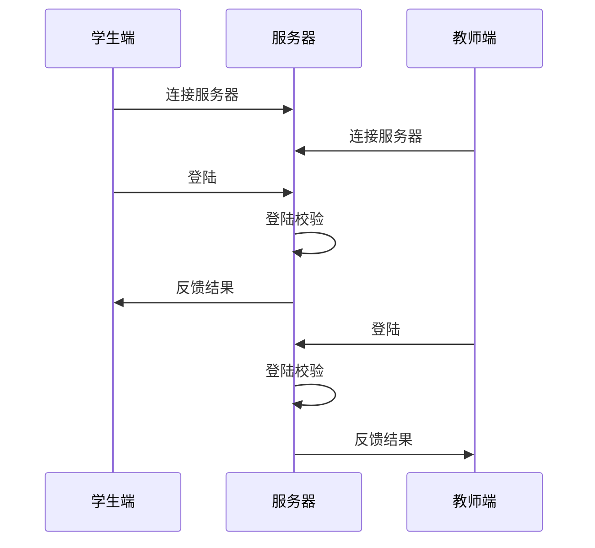
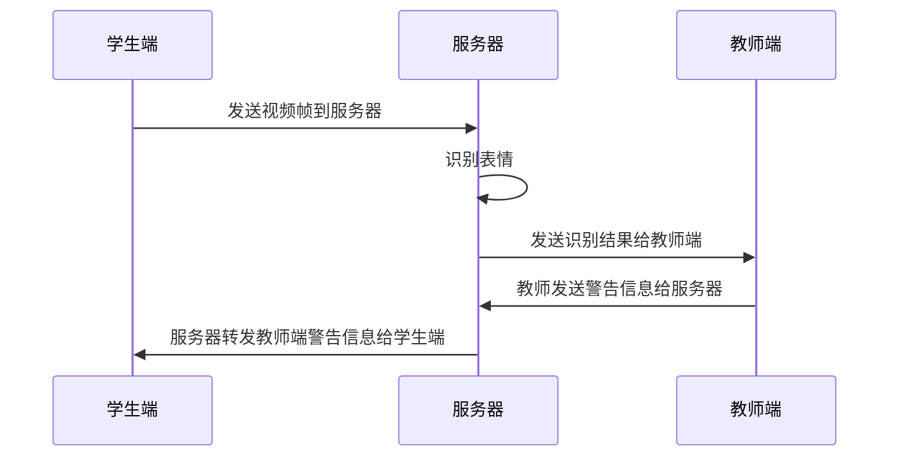

# Online Classroom Status Feedback System
> 线上课堂状态监测

## 编译说明
1. 根据不同平台不同，这里不具体说明环境搭建；
2. 环境：c++、qt、opencv、dlib、make以及cmake；
3. 编译：

    1. `git clone https://github.com/sunowsir/Student_Status_Identification.git`
    2. `cd Student_Status_Identification`
    3. `mkdir build`
    4. `cd build`
    5. `cmake -DCMAKE_EXPORT_COMPILE_COMMANDS=1 ../`
    6. `make`
    7. 编译完成后会在`../bin`下生成可执行文件`SSI`

## 技术说明
1. 语言：`c++`；
2. 开发框架：`qt`；
3. 图像处理库：`opencv`、`dlib`；

## 设计说明
> 如下以图像处理为主，其他部分例如UI部分则简略介绍；

### 整体流程

* 登陆流程



* 工作流程


其中，学生端包括图像采集模块，然后服务器端包括图像处理模块、数据分析模块，最后，教师端则是对服务器发来的各个学生的状态信息进行汇总和展示，以及下达警告信息，经由服务器转发给学生端，例如提醒某位学生摄像头内无人脸、未打开摄像头、状态不对等;

1. 学生端
    
    1. 图像采集
2. 服务器
3. 教师端

### UI

该程序使用qt来绘制UI，其中包括摄像头预览界面以及各种button等；


### 人脸识别器

    该类用来从图片中识别到人脸，然后从人脸矩阵中找到特征点

1. 涉及模型
    * 识别人脸使用opencv的haar识别模型，haarcascade_frontalface_alt.xml
    特征点识别使用dlib的68特征值识别模型，在构造该类的对象时，应当向构造函数中传入haar模型文件haarcascade_frontalface_alt.xml，以及dlib的68特征值识别模型文件shape_predictor_68_face_landmarks.dat；

2. 人脸识别流程详解

    1. `bool recognize(cv::Mat&)`

        使用人脸识别器时，先调用该方法，进行图像处理，在调用`faces_get`以及`shapes_get`获取数据;
        如下流程处理完毕后，数据会保存在类的`faces`以及`shapes`属性中；
        ```mermaid
        graph TB

        mstart(开始) --> cvtColor[ 提取灰度图像 ]
        cvtColor[ 提取灰度图像 ] --> assign[ 转化图片为矩阵数据 ]
        assign[ 转化图片为矩阵数据 ] --> detector[ 获取人脸区域 ]
        detector[ 获取人脸区域 ] --> get_sharps[ 获取人脸特征分布 ]
        get_sharps[ 获取人脸特征分布 ] --> mend(结束)
    ```

    2. `std::vector<dlib::rectangle>& faces_get()`
     
        返回类的`faces`属性，用于获取人脸区域数据；
    
    3. `std::vector<dlib::full_object_detection>& shapes_get()`
    
        返回类的`shapes`属性，用于获取特征值数据；


### 模型训练器

1. 简介
    * 该类用来训练表情识别模型，


2. 对外接口详解
 
    1. `bool load_train_data(const QString& /* image path */, const int& /* 类别名称 */);`
    
        该方法需传入两个参数，一个是训练图片的路径，另一个是这组图片是什么表情
        ```mermaid
        graph TB

        mstart(开始) --> args_parse[ 参数判断 ]
        args_parse[ 参数判断 ] --> read_img[ 读取图片 ]
        read_img[ 读取图片 ] --> csk[ 采集并保存特征点 ]
        csk[ 采集并保存特征点 ] --> mend(结束)
        ```
        1. 上述流程图中的 “**采集并保存特征点**”被封装到了一个内部方法`capture_and_save_keypoint`中：
        
            1. 方法原型：`bool capture_and_save_keypoint(cv::Mat&, float* = nullptr);`
            2. 流程如下：

                ```mermaid
                graph TB

                mstart(开始) --> face_reg[ 人脸识别 ]
                face_reg[ 人脸识别 ] --> calc_offset[ 计算系数 ]
                calc_offset[ 计算系数 ] --> calc_every_point[ 计算各点系数 ]
                calc_every_point[ 计算各点系数 ] --> save_offset[ 保存各点系数 ]
                save_offset[ 保存各点系数 ] --> mend(结束)
                ```

            3. 人脸识别：这里的人脸识别调用如上介绍的[人脸识别器](###人脸识别器)进行识别，得到面部区域以及特征点数据；
            4. 计算系数：流程中提到的 **计算系数** 指的是当前面部区域的高度；
            5. 计算各点系数：这里提到的 **计算各点系数** 指的是根据这两脸上的每一点计算得到的若干数据：
                1. 计算 $当前点到这张脸最左端距离 / 整张脸宽度$ 得到的数据保存下来;
                2. 计算 $当前点到这张脸最上端距离 / 整张脸高度$ 得到的数据保存下来;
            6. 保存各点系数：保存系数到类的属性里，当调用如下`bool train_module_2_xml();`方法时，将保存到属性中的系数传递给svm进行训练;

        2. 
    
    2. `bool train_module_2_xml();`
        
        创建svm对象，设置属性，传入各点计算得到的数据开始训练;

### 表情识别器

1. 简介
    * 该类用于识别表情，使用模型训练器训练得到的表情识别模型来进行表情识别，在构造该类的对象时，构造函数需要传入使用*模型训练器*训练得到的模型文件；


2. 对外接口说明
    1. `bool recognize(const QImage&, int& /* face type */);`
        该方法用于表情识别，需传入待识别图片以及传出参数表情类型，识别结束后，通过第二个表情类型这个传出参数，将表情类型传出；
        ```mermaid
        graph TB
        
        mstart(开始) --> face_reg[ 人脸识别 ]
        face_reg[ 人脸识别 ] --> calc_offset[ 计算系数 ]
        calc_offset[ 计算系数 ] --> calc_every_point[ 计算各点系数 ]
        calc_every_point[ 计算各点系数 ] --> query[ 调用模型查询 ]
        query[ 调用模型查询 ] --> ret[ 传出结果 ]
        ret[ 传出结果 ] --> mend(结束)

        ```

---
参考：
1. https://blog.csdn.net/u012819339/article/details/82262915
2. https://blog.csdn.net/zmdsjtu/article/details/53667929
